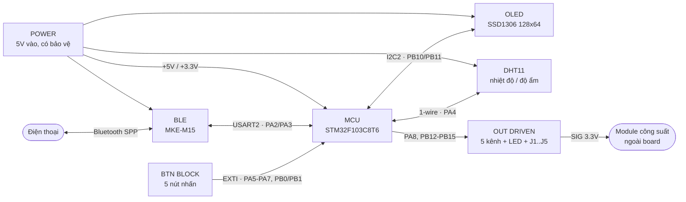

# 03 — Thiết kế phần cứng

Tài liệu này mô tả lại sơ đồ nguyên lý ở [`images/schematic.pdf`](images/schematic.pdf).
Schematic là nguồn sự thật; nếu tài liệu và schematic mâu thuẫn thì schematic đúng.

Mạch chia thành 6 khối: **POWER**, **MCU**, **BLE**, **OLED**, **HDT11** (cảm biến),
**BTN BLOCK** và **OUT DRIVEN**.

## 3.1 Sơ đồ khối



## 3.2 Khối nguồn (POWER)

Board nhận **5 V** từ ngoài, đi qua một chuỗi bảo vệ trước khi vào rail `+5V`.

| Ký hiệu | Linh kiện | Vai trò |
|---|---|---|
| J7 | Barrel jack có công tắc | Ngõ vào nguồn chính (adapter DC) |
| J9 | Terminal block KF301-2P | Ngõ vào nguồn thay thế (bắt vít) |
| JP1 | Jumper | Nối `ALT_RTN` về GND |
| F1 | Polyfuse 1812L110 (1,1 A) | Tự phục hồi khi quá dòng / chập tải |
| Q1 | MOSFET kênh P AO3401A | Chống cắm ngược cực nguồn, sụt áp thấp hơn nhiều so với diode nối tiếp |
| D6 | TVS SMBJ5.0A | Cắt xung quá áp trên đường 5 V |
| R11 | 100 kΩ | Kéo cực cổng Q1, bảo đảm MOSFET dẫn khi phân cực đúng |
| C1 | 100 nF | Lọc nhiễu tần số cao ở đầu vào |
| C2 | 470 µF / 10 V | Trữ năng lượng, gánh dòng đỉnh khi các LED cùng bật |
| C3, C4 | 100 nF, 10 µF | Lọc ở rail `+5V` sau bảo vệ |
| D7 + R12 | LED đỏ + 1 kΩ | Đèn báo có nguồn |
| J10 | Header 2 chân | **Ngõ vào 5 V dự phòng, cấp thẳng vào rail** |

> ⚠️ **J10 bỏ qua toàn bộ mạch bảo vệ** (F1 / D6 / Q1). Theo ghi chú trên schematic:
> chỉ dùng J10 khi **không** lắp khối nguồn SMD, và **không bao giờ cắm J10 cùng lúc với
> J7 hoặc J9**.

Rail `+3.3V` lấy từ bộ ổn áp có sẵn trên board Blue Pill.

## 3.3 Khối MCU

U2 là board **Blue Pill STM32F103C8T6** cắm nguyên khối (40 chân). Board mang sẵn thạch
anh 8 MHz, ổn áp 3.3 V, LED PC13 và jumper BOOT0/BOOT1.

Chi tiết chân xem [04 — Sơ đồ chân & ngoại vi](04-so-do-chan.md).

## 3.4 Khối BLE — module MKE-M15

| Chân module | Nối tới | Ghi chú |
|---|---|---|
| 1 · 5V | Rail `+5V` | Module tự hạ áp bên trong |
| 2 · GND | GND | |
| 3 · TX | **PA3** (USART2_RX) | Module phát → MCU nhận |
| 4 · RX | **PA2** (USART2_TX) | MCU phát → module nhận |

Mức logic của đường dữ liệu là 3.3 V, khớp với STM32 nên không cần mạch chia áp.

PA3 được cấu hình **có pull-up nội** (`main.c:704-709`) — chủ ý: nếu module chưa được cấp
nguồn hoặc dây bị đứt, chân thả nổi sẽ nhặt nhiễu và sinh framing error liên tục.

## 3.5 Khối OLED

Màn hình 0.96" SSD1306, module 4 chân (`0.96OLED_4P_MODULE_JX`).

| Chân | Nối tới |
|---|---|
| SDA | **PB11** (I2C2_SDA) |
| SCL | **PB10** (I2C2_SCL) |
| VCC | Rail `+3.3V` |
| GND | GND |

Header **J8** (`Conn_01x04`) đi song song, để cắm màn hình rời khi cần thử nghiệm.

Điện trở kéo lên của bus I2C nằm sẵn trên module OLED.

## 3.6 Khối cảm biến DHT11

Cảm biến cắm qua connector **J6** 3 chân: `GND` / `VCC` / `SIG`.

| Chân | Nối tới |
|---|---|
| SIG | **PA4** |
| VCC | Rail `+5V` |
| GND | GND |

> ⚠️ **Điểm cần kiểm tra khi lắp**: PA4 của STM32F103 **không phải chân 5 V tolerant**.
> Nếu module DHT11 đang dùng có sẵn điện trở kéo lên tới VCC = 5 V thì mức HIGH trên bus
> sẽ vượt ngưỡng cho phép của PA4. Hai cách xử lý: cấp `+3.3V` cho J6 thay vì `+5V`, hoặc
> bảo đảm module không có điện trở kéo lên riêng và chỉ dựa vào pull-up nội của MCU
> (firmware đã bật pull-up nội trong `DHT11_SetInput()`).

## 3.7 Khối ngõ ra (OUT DRIVEN)

Đây là khối làm nên chức năng chính. Năm kênh **hoàn toàn giống nhau**, mỗi kênh gồm:

```
OUT-n ──[ 330Ω ]──► chân SIG của Jn (ra module công suất ngoài)
      │
      └──[ 330Ω ]──►|── LED Dn ──► GND     (đèn báo trạng thái kênh)
```

| Kênh | Chân MCU | Điện trở | LED | Connector |
|---|---|---|---|---|
| OUT-1 | PA8 | R1, R2 (330 Ω) | D1 | J1 |
| OUT-2 | PB15 | R3, R4 (330 Ω) | D2 | J2 |
| OUT-3 | PB14 | R5, R6 (330 Ω) | D3 | J3 |
| OUT-4 | PB13 | R7, R8 (330 Ω) | D4 | J4 |
| OUT-5 | PB12 | R9, R10 (330 Ω) | D5 | J5 |

Mỗi connector `Jn` có 3 chân: **VCC (+5V)** · **GND** · **SIG**. Nhờ vậy một module relay
hoặc SSR rời cắm thẳng vào được, lấy luôn nguồn từ board.

**Trên board không có tầng công suất nào.** Không có relay, không có triac, không có
optocoupler. Chân SIG chỉ mang mức logic 3.3 V (khoảng vài mA sau điện trở 330 Ω) — đủ để
kích chân tín hiệu của module ngoài, không đủ để đóng cắt tải.

> 🔌 **An toàn điện**: mọi việc liên quan tới điện lưới 220 V — cách ly, khoảng cách an
> toàn, chống hồ quang — thuộc trách nhiệm của module công suất bên ngoài. Board này ở
> phía an toàn của ranh giới cách ly và phải luôn được giữ ở đó.

## 3.8 Khối nút nhấn (BTN BLOCK)

Năm nút nhấn thường mở, một đầu nối chân MCU, một đầu nối GND.

| Nút | Chân MCU | Vai trò |
|---|---|---|
| SW1 | PA5 | UP — lên |
| SW2 | PA6 | PREV — trang trước |
| SW3 | PA7 | OK — bật/tắt kênh đang chọn |
| SW4 | PB0 | DOWN — xuống |
| SW5 | PB1 | NEXT — trang kế |

**Không có điện trở kéo lên ngoài** và **không có tụ chống dội**: firmware dùng pull-up
nội của STM32 (mức nghỉ = HIGH, nhấn = LOW) và chống dội hoàn toàn bằng phần mềm
(xem [07](07-dac-ta-giao-dien-oled.md) §7.5).

## 3.9 Bảng linh kiện (BOM)

| Loại | Ký hiệu | Giá trị / Mã | SL |
|---|---|---|---|
| Board MCU | U2 | Blue Pill STM32F103C8T6 | 1 |
| Module Bluetooth | U1 | MKE-M15 | 1 |
| Màn hình | — | OLED 0.96" SSD1306, I2C, 4 chân | 1 |
| Cảm biến | — | DHT11 | 1 |
| MOSFET kênh P | Q1 | AO3401A | 1 |
| Polyfuse | F1 | 1812L110 | 1 |
| TVS | D6 | SMBJ5.0A | 1 |
| LED | D1–D5 | LED chỉ báo kênh | 5 |
| LED | D7 | LED đỏ báo nguồn | 1 |
| Điện trở | R1–R10 | 330 Ω | 10 |
| Điện trở | R11 | 100 kΩ | 1 |
| Điện trở | R12 | 1 kΩ | 1 |
| Tụ | C1, C3 | 100 nF | 2 |
| Tụ | C2 | 470 µF / 10 V | 1 |
| Tụ | C4 | 10 µF | 1 |
| Nút nhấn | SW1–SW5 | Tact switch | 5 |
| Connector | J1–J5 | Header 3 chân (VCC/GND/SIG) | 5 |
| Connector | J6 | Header 3 chân (DHT11) | 1 |
| Connector | J7 | Barrel jack có công tắc | 1 |
| Connector | J8 | Header 4 chân (OLED) | 1 |
| Connector | J9 | Terminal block KF301-2P | 1 |
| Connector | J10 | Header 2 chân (nguồn dự phòng) | 1 |
| Jumper | JP1 | Jumper 2 chân | 1 |

## 3.10 Danh mục kiểm tra trước khi cấp nguồn lần đầu

1. Đo thông mạch `+5V` ↔ `GND`: **không được** ngắn mạch.
2. Kiểm tra chiều Q1 (AO3401A) và D6 (TVS) — lắp ngược là hỏng ngay khi cấp nguồn.
3. Xác nhận **chỉ một** trong ba ngõ nguồn J7 / J9 / J10 được cắm.
4. Xác nhận jumper BOOT0 trên Blue Pill đang ở mức **0** (boot từ flash).
5. Cấp nguồn, kiểm tra LED D7 sáng và đo được 3,3 V trên rail `+3.3V`.
6. Chỉ cắm module công suất vào J1–J5 **sau khi** đã nạp firmware và xác nhận cả 5 LED
   D1–D5 đều tắt lúc khởi động (yêu cầu FR-25).
