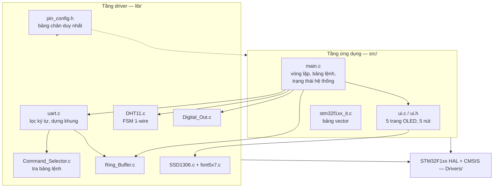
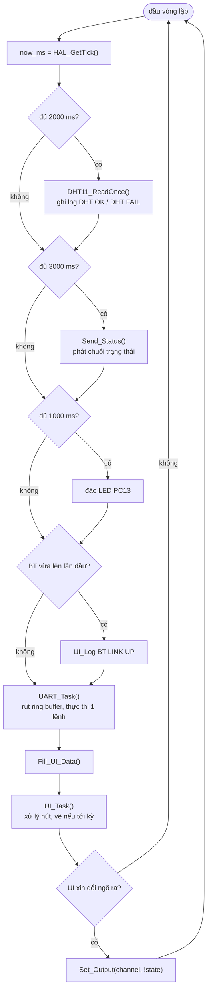
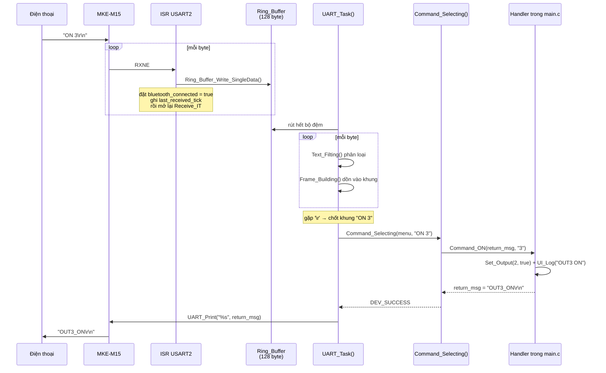
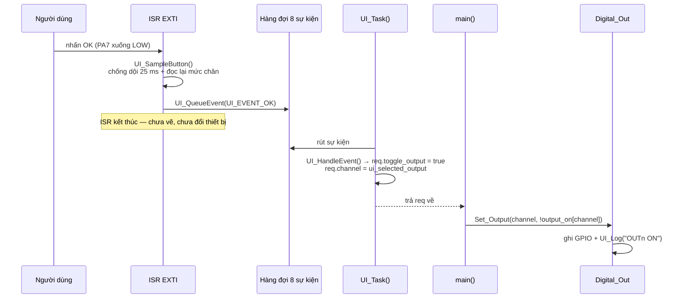

# 05 — Kiến trúc phần mềm

## 5.1 Nguyên tắc thiết kế

1. **Bare-metal superloop, không RTOS.** Một vòng `while(1)` duy nhất, mọi tác vụ định kỳ
   được nhịp bằng hiệu `HAL_GetTick()`.
2. **ISR ngắn nhất có thể.** Ngắt chỉ ghi vào bộ đệm/hàng đợi rồi thoát. Không vẽ màn hình,
   không ghi nhật ký, không đổi trạng thái thiết bị trong ISR.
3. **Một lối vào duy nhất cho mỗi hành động.** Bật/tắt thiết bị chỉ có một hàm
   `Set_Output()`; định dạng chuỗi trạng thái chỉ có một hàm `Format_Status()`.
4. **Chiều phụ thuộc một hướng.** `main.c` → `ui.h` → `lib/`. Tầng UI không biết gì về tầng
   ứng dụng; tầng `lib/` không biết gì về cả hai.
5. **Bảng chân tập trung.** Mọi port/pin/IRQn nằm ở `pin_config.h`.

## 5.2 Phân tầng

**Không có tầng trung gian** giữa `main.c` và `lib/` — đây là chủ ý cho một project cỡ này:
thêm một tầng "app_xxx.c" mỏng chỉ để chuyển tiếp lời gọi sẽ làm khó đọc hơn chứ không dễ hơn.

## 5.3 Bảng module

| File | Dòng | Trách nhiệm |
|---|---|---|
| `src/main.c` | ~818 | Khởi tạo phần cứng, trạng thái hệ thống, bảng lệnh Bluetooth, đọc DHT11, điều khiển 5 ngõ ra, vòng lặp chính, callback HAL |
| `src/ui.c` / `ui.h` | ~768 / 86 | 5 trang OLED, chống dội 5 nút, hàng đợi sự kiện, nhật ký 12 dòng |
| `src/stm32f1xx_it.c` | 111 | Bảng vector ngắt |
| `src/sysmem.c` | 30 | `_sbrk` cho newlib |
| `lib/uart.c/h` | ~313 | Lọc ký tự → dựng khung → phát lệnh → trả lời; theo dõi liên kết |
| `lib/Command_Selector.c/h` | ~51 | **Cơ chế** tra bảng lệnh (nội dung bảng nằm ở `main.c`) |
| `lib/Ring_Buffer.c/h` | ~120 | Bộ đệm vòng một-ghi/một-đọc |
| `lib/DHT11.c/h` | ~306 | FSM đọc cảm biến 1-wire bằng ngắt |
| `lib/Digital_Out.c/h` | ~40 | Một ngõ ra số generic theo {port, pin, state} |
| `lib/SSD1306.c/h` + `font5x7.c/h` | ~400 | Framebuffer + vẽ hình/chữ + đẩy khung qua I2C |
| `lib/pin_config.h` | 180 | Bảng chân duy nhất |
| `lib/Global_Enum.h` | 19 | `Developer_Action_Result_t` (`DEV_SUCCESS` / `DEV_FAIL`) |

## 5.4 Vòng lặp chính

`main.c:201-244`. Mỗi lượt làm đúng những việc sau, không có `HAL_Delay` nào:

### Bốn nhịp thời gian

| Nhịp | Hằng số | Giá trị | Việc làm |
|---|---|---|---|
| Đọc cảm biến | `SENSOR_PERIOD_MS` | 2000 ms | Một phép đo DHT11 trọn vẹn |
| Báo trạng thái | `STATUS_PERIOD_MS` | 3000 ms | Phát chuỗi trạng thái qua Bluetooth |
| Nhịp tim | `HEARTBEAT_PERIOD_MS` | 1000 ms | Đảo LED PC13 |
| Vẽ màn hình | `UI_REFRESH_PERIOD_MS` | 500 ms | Vẽ lại OLED (hoặc ngay lập tức khi có sự kiện) |

Mọi so sánh đều dạng `(now - last) >= T`. Dùng `now >= last + T` sẽ sai khi `HAL_GetTick()`
tràn sau ~49,7 ngày; phép trừ unsigned thì vẫn đúng.

## 5.5 Luồng nhận lệnh Bluetooth

Chi tiết cú pháp và bảng lệnh: [06 — Giao thức Bluetooth](06-giao-thuc-bluetooth.md).

**Vì sao mỗi lượt chỉ xử lý một lệnh** (`uart.c:287-292`): `UART_Print()` dùng
`HAL_UART_Transmit_IT` với một bộ đệm phát duy nhất; nếu xử lý liền hai lệnh trong cùng một
lượt thì câu trả lời thứ hai sẽ ghi đè lên câu thứ nhất khi nó còn đang được gửi. Trả quyền
về vòng lặp giữa hai lệnh cho HAL kịp gửi xong.

**Vì sao rút cạn bộ đệm chứ không một byte mỗi lượt** (`uart.c:275-279`): vòng lặp có lúc
bị `DHT11_ReadOnce()` giữ tới 500 ms; xử lý nhỏ giọt thì bộ đệm 128 byte đầy trước khi kịp
tiêu thụ.

## 5.6 Luồng điều khiển bằng nút

**Vì sao UI không tự bật thiết bị**: nếu `ui.c` gọi thẳng GPIO thì nó phải biết bảng
`outputs[]`, phải biết `output_on_state[]`, và phải ghi nhật ký — tức là phải biết gần hết
tầng ứng dụng. Cơ chế "UI chỉ *đề nghị*, `main.c` *thi hành*" giữ chiều phụ thuộc một
hướng, đồng thời bảo đảm **mọi** lối vào bật/tắt đều đi qua đúng một hàm (yêu cầu FR-06).

## 5.7 Trạng thái hệ thống

Toàn bộ trạng thái nằm ở các biến `static` đầu `main.c` (`main.c:56-61`):

| Biến | Kiểu | Ý nghĩa |
|---|---|---|
| `last_temp` | `uint8_t` | Nhiệt độ đọc được lần cuối (°C) |
| `last_humidity` | `uint8_t` | Độ ẩm đọc được lần cuối (%) |
| `output_on[5]` | `bool` | Trạng thái logic của 5 kênh |
| `bluetooth_connected` | `bool` | Đã từng nhận được byte từ module BT |
| `sensor_valid` | `bool` | Đã từng đọc DHT11 thành công |
| `last_sensor_ok_ms` | `uint32_t` | Mốc tick của lần đọc thành công gần nhất |

`Fill_UI_Data()` (`main.c:390`) sao chụp các giá trị này sang `UI_Data_t` mỗi vòng lặp. UI
không bao giờ tự đọc phần cứng, và cũng không giữ bản sao lâu dài — nhờ vậy đổi bố cục màn
hình không kéo theo sửa logic và ngược lại.

**Không có persistence.** Không ghi flash, không EEPROM. Sau reset mọi kênh trở về TẮT —
đây là trạng thái an toàn được chọn có chủ ý (FR-25).

## 5.8 Quy tắc đồng bộ giữa ISR và vòng lặp chính

Project không dùng khoá ngắt (`__disable_irq`) ở bất kỳ đâu ngoài `Error_Handler()`. Thay
vào đó dựa trên ba tính chất:

| Dữ liệu chia sẻ | Cơ chế an toàn |
|---|---|
| `Ring_Buffer` (byte UART) | Một người ghi (ISR) và một người đọc (vòng lặp), mỗi bên chỉ sửa chỉ số của riêng mình; cả hai chỉ số là 1 byte → đọc/ghi nguyên tử trên Cortex-M3 |
| Hàng đợi sự kiện nút | Cùng cơ chế, `ui_event_head` do ISR ghi, `ui_event_tail` do vòng lặp ghi |
| `dht_current_state` | `volatile`, kiểu enum nằm gọn trong một từ → đọc/ghi là một lệnh đơn |
| `dht_raw_data[5]` | Vòng lặp chỉ đọc **sau khi** FSM sang `COMPLETE`; từ lúc đó ISR không còn chạm vào mảng |
| `dht_cfg` | Ghi một lần trong `DHT11_Init()`, trước khi ngắt đầu tiên xảy ra → chỉ đọc về sau |

Quy tắc thành văn: **không gọi `UI_Log()` từ ISR** (`ui.h:82`) — nó ghi vào chính bộ đệm
vòng mà `UI_Task()` đang đọc để vẽ. Đó là lý do việc ghi log "BT LINK UP" được hoãn ra vòng
lặp chính (`main.c:224-230`) thay vì làm ngay trong `HAL_UART_RxCpltCallback()`.

## 5.9 Xử lý lỗi

| Tình huống | Cách xử lý |
|---|---|
| Khởi tạo ngoại vi thất bại | `Error_Handler()` — tắt ngắt và treo. LED PC13 ngừng nháy = dấu hiệu nhận biết |
| UART tràn (ORE) | `HAL_UART_ErrorCallback()` (`main.c:775`) đọc DR để xoá cờ và **mở lại** `Receive_IT`. Không có bước này thì Bluetooth "chết câm" vĩnh viễn sau lần tràn đầu tiên |
| Ring buffer đầy | Bỏ byte mới, vẫn mở lại phiên nhận (`main.c:762`) — bỏ một byte còn hơn ngừng nhận |
| Khung lệnh tràn 128 byte | Chỉ số dừng ở mốc tràn, không quay vòng; khi chốt khung thì trả `Fail, try again!` |
| Hàng đợi sự kiện nút đầy | Bỏ sự kiện mới, không ghi đè (`ui.c:275-283`) |
| DHT11 sai checksum / quá hạn | Trả `false`, **không cập nhật** `last_temp`/`last_humidity`; ghi log `DHT FAIL` |
| Nút kẹt trạng thái "đang nhấn" | `UI_ReleaseStaleButtons()` chạy mỗi vòng lặp, đọc lại mức thật để tự gỡ |
| `UART_Print` gọi lúc đang bận gửi | Bỏ bản tin (`uart.c:204-206`) — xem [12](12-han-che-va-huong-phat-trien.md) §12.1 |
