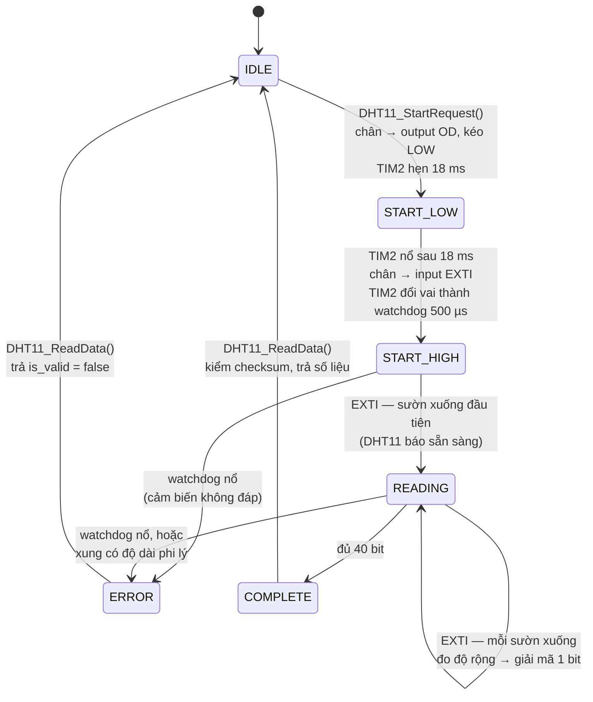

# 08 — Đặc tả cảm biến DHT11

## 8.1 Giao thức 1-wire

DHT11 dùng **một dây dữ liệu hai chiều**. Cả MCU lẫn cảm biến chỉ được phép **kéo xuống**;
mức cao do điện trở kéo lên tạo ra. Vì vậy chân PA4 phải là **open-drain** khi làm ngõ ra.

Một phiên đo diễn ra như sau:

```
MCU kéo LOW ≥18 ms          MCU nhả bus         DHT11 đáp          40 bit dữ liệu
├──────────────────────────┤├─────────────┤├──────────────┤├────────────────────────┤
        START                  chờ đáp        80µs L + 80µs H     5 byte, MSB trước
```

40 bit = 5 byte:

| Byte | Nội dung |
|---|---|
| 0 | Độ ẩm, phần nguyên (%) |
| 1 | Độ ẩm, phần thập phân — **DHT11 luôn trả 0** |
| 2 | Nhiệt độ, phần nguyên (°C) |
| 3 | Nhiệt độ, phần thập phân — **DHT11 luôn trả 0** |
| 4 | Checksum = tổng 4 byte trên (bỏ tràn 8 bit) |

Vì hai byte thập phân luôn bằng 0, firmware **bỏ qua chúng** thay vì hiển thị `.0` giả.

Mỗi bit dữ liệu bắt đầu bằng một xung LOW 50 µs, rồi độ dài mức HIGH quyết định giá trị:
bit `0` ≈ 26–28 µs HIGH, bit `1` ≈ 70 µs HIGH. Driver **không đo mức HIGH trực tiếp** mà
đo **khoảng cách giữa hai sườn xuống liên tiếp** — đơn giản hơn và chỉ cần bắt một loại
cạnh.

## 8.2 Ngưỡng phân loại xung

Đo bằng TIM2 ở 1 MHz, đơn vị micro-giây (`DHT11.c:11-19`):

| Hằng số | Giá trị | Ý nghĩa |
|---|---|---|
| `DHT11_PULSE_BIT0_MIN_US` | 60 | Dưới ngưỡng này → xung phi lý → lỗi |
| `DHT11_PULSE_BIT0_MAX_US` | 100 | 60–100 µs → **bit 0** (datasheet ~76 µs) |
| `DHT11_PULSE_BIT1_MAX_US` | 140 | 100–140 µs → **bit 1** (datasheet ~120 µs) |
| `DHT11_PULSE_ACK_MAX_US` | 180 | 140–180 µs → **nhịp mồi (ACK)**, không phải bit dữ liệu |
| `DHT11_START_LOW_TIME_US` | 18000 | Thời gian kéo LOW của lệnh Start (tối thiểu 18 ms) |
| `DHT11_WATCHDOG_US` | 500 | Quá hạn chờ phản hồi hoặc chờ bit kế tiếp |

Xung nằm ngoài mọi dải trên → chuyển thẳng sang trạng thái `ERROR`.

Các dải rộng hơn giá trị danh định trong datasheet có chủ ý: chúng phải chịu được độ trễ
ngắt trong thực tế (xem [09 — Timing và ngắt](09-timing-va-ngat.md)).

## 8.3 Máy trạng thái



Ba trạng thái `IDLE` / `COMPLETE` / `ERROR` là các trạng thái "rảnh": chỉ khi FSM đang ở một
trong ba trạng thái đó thì `DHT11_StartRequest()` mới nhận yêu cầu mới. Cắt ngang một phiên
đang đọc sẽ làm hỏng cả khung 40 bit.

## 8.4 TIM2 mang hai vai

TIM2 chạy tự do ở **1 MHz** (1 tick = 1 µs), và trong một phiên đo nó lần lượt đóng hai vai:

| Pha | Vai trò của TIM2 |
|---|---|
| `START_LOW` | **Hẹn giờ**: autoreload = 18000 → ngắt báo đã kéo LOW đủ 18 ms |
| `START_HIGH`, `READING` | **Watchdog**: autoreload = 500 → nếu ngắt nổ nghĩa là quá 500 µs không có sườn xuống nào ⇒ bus đứt |
| Trong ISR EXTI | **Đồng hồ đo**: đọc `__HAL_TIM_GET_COUNTER()` rồi reset về 0 — mỗi phép đo tính từ sườn xuống trước đó |

Prescaler **không ghi cứng** mà tính từ `HAL_RCC_GetPCLK1Freq()` (`main.c:647-677`), và
`Error_Handler()` được gọi nếu không chia ra được đúng 1 MHz. Nhờ vậy đổi cây clock sẽ báo
lỗi ngay lúc khởi động thay vì làm sai lặng lẽ toàn bộ timing của cảm biến.

## 8.5 Chuyển chân giữa hai chế độ

`DHT11_SetOutput()` (`DHT11.c:105`) làm ba việc **theo đúng thứ tự** trước khi đổi mode:

```c
HAL_NVIC_DisableIRQ(dht_cfg.IRQn);
EXTI->IMR &= ~((uint32_t)dht_cfg.Pin);  /* che ngắt của riêng chân này */
EXTI->PR  = dht_cfg.Pin;                /* xoá cờ pending (ghi 1 để xoá) */
```

Lý do: HAL **không tự gỡ EXTI mask** khi chuyển một chân từ `IT_FALLING` sang `OUTPUT`. Nếu
không che tay, chính MCU sẽ tự kích ngắt EXTI ngay lúc nó kéo bus xuống LOW để phát lệnh
Start — và ISR sẽ bắt đầu "giải mã" tín hiệu do chính nó tạo ra.

`DHT11_SetInput()` (`DHT11.c:86`) đi chiều ngược lại: cấu hình `IT_FALLING` + pull-up nội,
**xoá cờ ngắt cũ rồi mới** cho phép ngắt trên NVIC.

## 8.6 Cách tầng ứng dụng gọi

`DHT11_ReadOnce()` (`main.c:333`) chạy một phép đo trọn vẹn:

```c
DHT11_StartRequest();
while ((HAL_GetTick() - start_ms) < 500) {   /* DHT11_POLL_TIMEOUT_MS */
    if ((HAL_GetTick() - last_poll_ms) < 5) continue;   /* poll mỗi 5 ms */
    last_poll_ms += 5;

    state = DHT11_ReadData(&dht_data);
    if (state == DHT11_STATE_COMPLETE) {
        if (!dht_data.is_valid) return false;   /* checksum sai */
        last_temp = dht_data.temp_int;
        last_humidity = dht_data.humidity_int;
        last_sensor_ok_ms = HAL_GetTick();
        sensor_valid = true;
        return true;
    }
    if (state == DHT11_STATE_ERROR) return false;
}
return false;   /* quá hạn */
```

Ba điểm đáng chú ý:

- **Không dùng `HAL_Delay`** để giữ nhịp poll: nó khoá CPU chờ trong SysTick handler. Dùng
  hiệu tick thay thế.
- Mốc poll đầu tiên bị **lùi lại một chu kỳ** (`last_poll_ms = start_ms - 5`) để lần poll
  đầu chạy ngay, không phải chờ 5 ms vô ích.
- Cập nhật `last_sensor_ok_ms` là điều kiện để trang SENSOR nói được `LAST OK 4s` — nếu
  không có mốc này thì khi cảm biến hỏng, số đo cũ vẫn hiện và không cách nào phân biệt số
  tươi với số đã chết (yêu cầu FR-18).

## 8.7 Đây là tác vụ nặng nhất của vòng lặp

`DHT11_ReadOnce()` **chặn tới 500 ms**. Ở 9600 baud, trong 500 ms có thể có tới ~500 byte
đổ về mà vòng lặp chính không rút được — bộ đệm vòng 128 byte tồn tại chính là để bù cho
việc này (thực tế lệnh chỉ dài vài chục byte nên 128 là dư).

> ⚠️ **Quy tắc bảo trì**: không được thêm tác vụ chặn thứ hai vào vòng lặp chính
> (yêu cầu NFR-03). Xem [09 — Timing và ngắt](09-timing-va-ngat.md) §9.2.

Trên thực tế một phiên đo thành công chỉ mất khoảng **22–25 ms** (18 ms Start + ~4 ms truyền
40 bit); con số 500 ms là hạn chót cho trường hợp cảm biến không đáp, chứ không phải thời
gian thường gặp.

## 8.8 Xử lý lỗi

| Tình huống | Phát hiện bằng | Kết quả |
|---|---|---|
| Cảm biến không cắm / đứt dây | Watchdog 500 µs ở `START_HIGH` | `ERROR` → `DHT FAIL`, số liệu cũ giữ nguyên |
| Nhiễu giữa phiên đọc | Xung có độ rộng ngoài mọi dải | `ERROR` → `DHT FAIL` |
| Mất bit do ngắt bị chèn | Đủ 40 bit nhưng checksum sai | `is_valid = false` → `DHT FAIL` |
| FSM kẹt (không nên xảy ra) | Vòng poll quá 500 ms | `DHT_ReadOnce()` trả `false` |

Trong **mọi** trường hợp lỗi, `last_temp` và `last_humidity` **không bị cập nhật**
(yêu cầu FR-17) — thà hiện số cũ kèm mốc `LAST OK` còn hơn hiện số rác.

Hệ thống tự phục hồi: phép đo kế tiếp diễn ra sau 2 giây, và `DHT11_ReadData()` đã đưa FSM
về `IDLE` khi trả kết quả lỗi. Cắm lại cảm biến là lần đọc sau chạy bình thường, không cần
reset board.

## 8.9 Giới hạn của DHT11

| Thuộc tính | Giá trị |
|---|---|
| Dải nhiệt độ | 0–50 °C, sai số ±2 °C |
| Dải độ ẩm | 20–90 %RH, sai số ±5 %RH |
| Độ phân giải | 1 °C / 1 % |
| Chu kỳ đo tối thiểu | ~1 giây (firmware dùng 2 giây, an toàn) |

Thang thanh mức nhiệt độ trên OLED đặt **0–50 °C** (`UI_TEMP_SCALE_MAX_C`) đúng bằng dải đo
của cảm biến.
