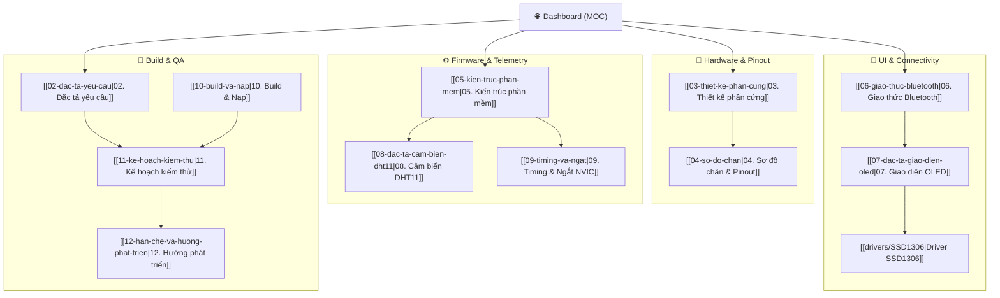

# 🛰️ Bluetooth-Based Device Control — Knowledge Hub

> [!abstract] **Project Overview**
> Multi-channel power device control hub powered by **STM32F103C8T6 (Blue Pill)** and **MKE-M15 Bluetooth Module (SPP)**. Features 5 independent digital outputs, onboard 0.96" SSD1306 OLED UI, DHT11 1-wire environment telemetry, non-blocking interrupt-driven superloop, and 5 physical navigation buttons.

---

## 🗺️ Interactive Navigation Grid

---

## 📚 Document Index by Category

### 1. 🏗️ Architecture & Requirements
> [!info] **System Foundations**
> Core system specifications, hardware blocks, and pinout definitions.

- [[01-tong-quan|01. Tổng quan dự án]] `#system` `#overview`
  *Scope, operating requirements, and high-level workflow.*
- [[02-dac-ta-yeu-cau|02. Đặc tả yêu cầu (FR / NFR)]] `#requirements` `#specs`
  *Functional and Non-functional requirements matrix.*
- [[03-thiet-ke-phan-cung|03. Thiết kế phần cứng]] `#hardware` `#schematic`
  *Circuit schematics, power protection, and Bill of Materials (BOM).*
- [[04-so-do-chan|04. Sơ đồ chân & Ngoại vi]] `#hardware` `#pinout`
  *Pin assignments, peripheral mapping, and NVIC priority layout.*

---

### 2. ⚡ Firmware & Peripherals
> [!tip] **Bare-metal Superloop & Drivers**
> Timing constraints, interrupt priority assignments, and low-level drivers.

- [[05-kien-truc-phan-mem|05. Kiến trúc phần mềm]] `#firmware` `#architecture`
  *Bare-metal superloop flow, data processing pipeline, and modular layer rules.*
- [[08-dac-ta-cam-bien-dht11|08. Đặc tả cảm biến DHT11]] `#sensor` `#dht11`
  *1-wire protocol decoding via EXTI & TIM2 counter.*
- [[09-timing-va-ngat|09. Timing và Ngắt]] `#timing` `#interrupts`
  *NVIC preemption priorities, latency calculations, and interrupt safety.*
- [[drivers/SSD1306|Driver SSD1306]] `#display` `#driver`
  *I2C communication, RAM framebuffer rendering, and font 5x7 engine.*

---

### 3. 📡 Bluetooth & User Interface
> [!note] **Human & Remote Interfaces**
> Bluetooth command parser, protocol frames, and 5-page OLED menu structure.

- [[06-giao-thuc-bluetooth|06. Giao thức Bluetooth]] `#protocol` `#bluetooth`
  *ASCII command sets (`ON`, `OFF`, `STATUS`, `TEMP`, `HUM`), response frames, and error states.*
- [[07-dac-ta-giao-dien-oled|07. Đặc tả giao diện OLED]] `#display` `#ui`
  *5 interactive pages: Home Dashboard, Output Channels, Sensor Details, Event Log, and Help.*

---

### 4. 🛠️ Build, Testing & Roadmap
> [!check] **Verification & Deployment**
> Build scripts, ST-Link flashing, test verification cases, and known constraints.

- [[10-build-va-nap|10. Build và Nạp firmware]] `#build` `#toolchain`
  *GCC ARM toolchain, CMake/Ninja configuration, and flashing instructions.*
- [[11-ke-hoach-kiem-thu|11. Kế hoạch kiểm thử]] `#testing` `#qa`
  *79 manual & automated test cases verifying all hardware and protocol features.*
- [[12-han-che-va-huong-phat-trien|12. Hạn chế và Hướng phát triển]] `#roadmap` `#improvements`
  *Known limitations, EEPROM persistence, and future roadmap.*

---

## 🏷️ Tag Explorer

| Tag | Topic | Primary Documents |
| :--- | :--- | :--- |
| `#hardware` | Schematics, BOM, Pinout | [[03-thiet-ke-phan-cung]], [[04-so-do-chan]] |
| `#firmware` | Superloop, Architecture, HAL | [[05-kien-truc-phan-mem]], [[main.c]] |
| `#sensor` | DHT11 1-wire Telemetry | [[08-dac-ta-cam-bien-dht11]] |
| `#display` | OLED UI, SSD1306 Driver | [[07-dac-ta-giao-dien-oled]], [[drivers/SSD1306]] |
| `#protocol` | Bluetooth SPP Command Set | [[06-giao-thuc-bluetooth]] |
| `#timing` | NVIC Priorities & Latencies | [[09-timing-va-ngat]] |
| `#testing` | Verification Test Matrix | [[11-ke-hoach-kiem-thu]] |
| `#build` | Toolchain & Flashing | [[10-build-va-nap]] |

---

> [!tip] **Visual Whiteboard**
> Open `Architecture.canvas` in Obsidian to view the interactive 2D node map of the system.
