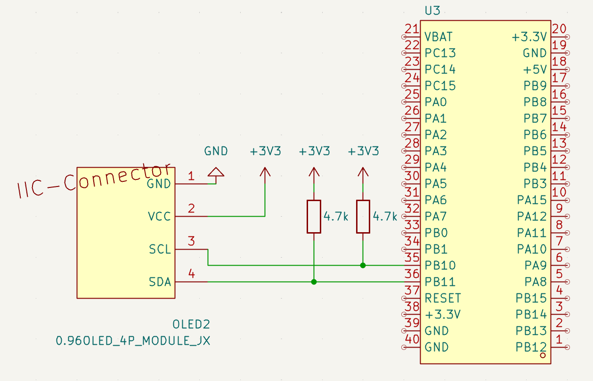
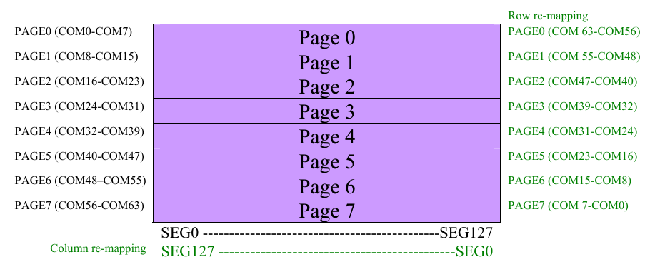
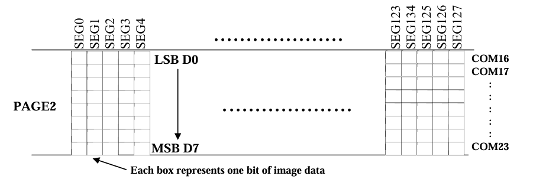

# I2C SSD1306 How to use

## 1. Giới thiệu

OLED SSD1306 là màn hình đồ hoạ 128×64 pixel, giao tiếp theo chuẩn I2C. Dùng 4 chân: `SDA, SCL, VCC, GND`. Module SSD1306 có thể dùng nguồn `3.3V` hoặc `5V`.

## 2. Chi tiết hoạt động

### 2.1 Sơ đồ nối dây



**Chú ý**: STM32F103C8T6 Bluepill có thể hỗ trợ tối đa 2 channel `I2C`, do đó ta có thể thay đổi chân `SDA` và `SCL` theo nhu cầu. Ví dụ, ta có thể dùng:

- `SDA` = `PB7`, `SCL` = `PB6` (`I2C1`, có thể remap sang `SDA` = `PB9`, `SCL` = `PB8`)
- `SDA` = `PB11`, `SCL` = `PB10` (`I2C2`, không có phương án remap) — **đây là cấu hình
  đang dùng trong dự án này**.

### 2.2 Graphic Display Data RAM (GDDRAM)

`GDDRAM` là một bộ nhớ RAM tĩnh giữ các bit được hiển thị lên màn hình. Kích thước của màn hình là `128x64` pixel, với mỗi `pixel` tương ứng với `1 bit` trong `GDDRAM`, do đó, kích thước của `GDDRAM` là `128x64/8 = 1024 bytes`.



Màn hình được chia thành 8 trang (page), mỗi trang có 8 hàng (row) pixel. Mỗi byte trong `GDDRAM` đại diện cho một cột pixel trong một trang, với bit thấp nhất (LSB) là pixel trên cùng và bit cao nhất (MSB) là pixel dưới cùng.



**Chú ý:** có thể remap layout bằng phần mềm (gửi command thông qua giao thức I2C) để thay chiều vị trí của các bit trong byte, ví dụ, bit thấp nhất (LSB) có thể là pixel dưới cùng và bit cao nhất (MSB) là pixel trên cùng.

Ví dụ, nếu ta gửi dữ liệu `0xFF` đến một byte trong `GDDRAM`, tất cả các pixel trong cột đó sẽ sáng lên. Nếu gửi `0x00`, tất cả các pixel sẽ tắt.

## 3. Thư viện SSD1306

### 3.1 Cấu trúc thư viện

Driver nằm ở hai file chính, kèm một file dữ liệu font tách riêng:

| File | Vai trò |
| ---- | ------- |
| `lib/Inc/SSD1306.h` | Khai báo hằng số, kiểu dữ liệu và toàn bộ API công khai |
| `lib/Src/SSD1306.c` | Cài đặt driver |
| `lib/Inc/font5x7.h`, `lib/Src/font5x7.c` | Bảng glyph 5×7 pixel cho ASCII `0x20..0x7E` và ký hiệu độ (`°`) |

Thư viện được chia thành **3 lớp**, xếp chồng từ dưới lên:

```text
┌─────────────────────────────────────────────┐
│  Lớp văn bản                                │
│  SSD1306_WriteChar / SSD1306_WriteString    │  <- dùng bảng font5x7
├─────────────────────────────────────────────┤
│  Lớp framebuffer (chỉ sửa RAM của MCU)      │
│  Fill / Clear / DrawPixel / DrawBitmap      │
│  FillRect / DrawRect                        │
├─────────────────────────────────────────────┤
│  Lớp giao tiếp phần cứng (I2C)              │
│  Init / SendCommand / SendData / DisplayOn  │
│  DisplayOff / SetContrast / InvertDisplay   │
│  SetCursor                                  │
└─────────────────────────────────────────────┘
                      │
              SSD1306_UpdateScreen()
        (cầu nối: đẩy framebuffer -> GDDRAM)
```

Ý tưởng cốt lõi: **mọi thao tác vẽ đều diễn ra trong RAM của MCU**, không đụng tới I2C. Chỉ khi gọi `SSD1306_UpdateScreen()` thì toàn bộ framebuffer mới được đẩy một lần sang `GDDRAM` của chip. Cách này tránh việc mỗi lần bật/tắt một pixel lại phải tốn một giao dịch I2C — vốn chậm hơn thao tác RAM hàng nghìn lần.

Kích thước màn hình được cấu hình bằng macro trong `SSD1306.h`:

```c
#define SSD1306_WIDTH  128
#define SSD1306_HEIGHT 64
#define SSD1306_BUFFER_SIZE ((SSD1306_WIDTH * SSD1306_HEIGHT) / 8)  /* = 1024 bytes */
```

Nếu dùng module `128x32`, đổi `SSD1306_HEIGHT` thành `32` và sửa thêm hai lệnh khởi tạo tương ứng (xem mục 3.2).

### 3.2 Lớp giao tiếp phần cứng (I2C)

Đây là lớp thấp nhất, làm việc trực tiếp với chip qua STM32 HAL I2C và **không đụng tới framebuffer**. Mọi hàm ở lớp này đều trả về `HAL_StatusTypeDef` lấy từ HAL, nên gọi xong nên kiểm tra `!= HAL_OK`.

#### 3.2.1 Địa chỉ I2C và control byte

```c
#define SSD1306_I2C_ADDRESS (0x3C << 1)   /* = 0x78 */
```

SSD1306 dùng địa chỉ 7-bit `0x3C` (một số module hàn lại pad thành `0x3D`). HAL của STM32 nhận địa chỉ **8-bit đã dịch trái**, nên phải viết `0x3C << 1 = 0x78`. Đây cũng chính là giá trị của hằng `SSD1306_DEFAULT_ADDRESS` trong enum lệnh.

Mọi giao dịch I2C tới SSD1306 đều bắt đầu bằng một **control byte** báo cho chip biết các byte theo sau là lệnh hay dữ liệu pixel:

| Control byte | Ý nghĩa | Dùng ở hàm |
| ------------ | ------- | ---------- |
| `0x00` | Co = 0, D/C# = 0 → các byte còn lại là **lệnh** | `SSD1306_Init`, `SSD1306_SendCommand` |
| `0x40` | Co = 0, D/C# = 1 → các byte còn lại là **dữ liệu** ghi vào GDDRAM | `SSD1306_SendData` |

Vì `Co = 0`, chip hiểu là "tất cả byte còn lại trong giao dịch này cùng loại", nên có thể gửi cả chuỗi lệnh dài trong **một** lần `HAL_I2C_Master_Transmit()` thay vì mỗi lệnh một giao dịch.

#### 3.2.2 `SSD1306_Init()` — chuỗi lệnh khởi tạo

```c
HAL_StatusTypeDef SSD1306_Init (I2C_HandleTypeDef* hi2c);
```

Gọi **một lần** sau khi peripheral I2C đã được khởi tạo (`MX_I2C2_Init()`). Hàm gửi một mảng lệnh cấu hình duy nhất, mở đầu bằng control byte `0x00`:

| Lệnh | Ý nghĩa | Ghi chú cho màn 128×32 |
| ---- | ------- | ---------------------- |
| `0xAE` | Display OFF — tắt hiển thị trong lúc cấu hình | |
| `0xD5, 0x80` | Tần số dao động / tỉ lệ chia clock (giá trị khuyến nghị) | |
| `0xA8, 0x3F` | Multiplex ratio = 63 (số hàng − 1) | dùng `0x1F` |
| `0xD3, 0x00` | Display offset = 0 | |
| `0x40` | Start line = 0 | |
| `0x8D, 0x14` | Bật **charge pump** | |
| `0x20, 0x00` | Memory addressing mode = **Horizontal** | |
| `0xA1` | Segment re-map — lật ngang | |
| `0xC8` | COM scan direction giảm dần — lật dọc | |
| `0xDA, 0x12` | Cấu hình phần cứng chân COM | dùng `0x02` |
| `0x81, 0xCF` | Contrast | |
| `0xD9, 0xF1` | Pre-charge period | |
| `0xDB, 0x40` | VCOMH deselect level | |
| `0xA4` | Hiển thị theo nội dung RAM (không ép sáng toàn bộ) | |
| `0xA6` | Chế độ hiển thị bình thường (không đảo màu) | |
| `0xAF` | **Display ON** — lệnh bật màn hình | |

Ba nhóm lệnh đáng chú ý nhất:

- `0x8D, 0x14` (charge pump): SSD1306 cần điện áp ~7.5 V để đánh sáng OLED, được tạo bên trong chip bằng mạch charge pump. Quên lệnh này là nguyên nhân phổ biến nhất khiến "code chạy mà màn hình vẫn đen".
- `0xA1` + `0xC8` (segment re-map + COM scan direction): quyết định gốc toạ độ nằm ở góc nào — chính là cơ chế remap layout đã nói ở mục 2.2. Nếu hình hiển thị bị lật ngược, đổi cặp này thành `0xA0` + `0xC0`.
- `0x20, 0x00` đặt chip ở **Horizontal Addressing Mode**: ghi hết một page thì con trỏ tự nhảy sang đầu page kế tiếp. Nhờ vậy `SSD1306_UpdateScreen()` chỉ cần khoanh vùng ghi một lần rồi stream thẳng 1024 byte (xem mục 3.4).

#### 3.2.3 Gửi lệnh và dữ liệu

```c
HAL_StatusTypeDef SSD1306_SendCommand (I2C_HandleTypeDef* hi2c, uint8_t command);
HAL_StatusTypeDef SSD1306_SendData (I2C_HandleTypeDef* hi2c, uint8_t* data, size_t size);
```

- `SSD1306_SendCommand()` gửi mảng 2 byte `{ 0x00, command }`. Với lệnh nhiều byte (ví dụ set contrast), gọi liên tiếp nhiều lần.
- `SSD1306_SendData()` dùng `HAL_I2C_Mem_Write()` với "địa chỉ thanh ghi" là control byte `0x40`, tức HAL tự chèn `0x40` trước khối dữ liệu. Đây là hàm dùng để đẩy cả framebuffer 1024 byte sang GDDRAM.

#### 3.2.4 Điều khiển hiển thị

```c
HAL_StatusTypeDef SSD1306_DisplayOn     (I2C_HandleTypeDef* hi2c);
HAL_StatusTypeDef SSD1306_DisplayOff    (I2C_HandleTypeDef* hi2c);
HAL_StatusTypeDef SSD1306_SetContrast   (I2C_HandleTypeDef* hi2c, uint8_t value);
HAL_StatusTypeDef SSD1306_InvertDisplay (I2C_HandleTypeDef* hi2c, uint8_t invert);
HAL_StatusTypeDef SSD1306_SetCursor     (I2C_HandleTypeDef* hi2c, uint8_t x, uint8_t page);
```

| Hàm | Lệnh gửi đi | Mô tả |
| --- | ----------- | ----- |
| `SSD1306_DisplayOn` | `0xAF` | Bật nguồn hiển thị. **Không** xoá GDDRAM — nội dung cũ hiện lại nguyên vẹn |
| `SSD1306_DisplayOff` | `0xAE` | Tắt hiển thị (sleep mode), GDDRAM vẫn giữ nguyên. Dùng để tiết kiệm điện |
| `SSD1306_SetContrast` | `0x81`, `value` | Độ tương phản `0x00`–`0xFF` |
| `SSD1306_InvertDisplay` | `0xA7` / `0xA6` | `invert != 0` → đảo màu toàn màn hình; `0` → trở về bình thường |
| `SSD1306_SetCursor` | `0xB0\|page`, `0x00\|(x & 0x0F)`, `0x10\|(x >> 4)` | Đặt con trỏ ghi GDDRAM về cột `x`, trang `page` (`page = y / 8`, 0–7) |

Ba hàm cuối gửi nhiều byte lệnh nối tiếp; nếu một byte lỗi, hàm dừng ngay và trả `HAL_ERROR` thay vì gửi tiếp phần còn lại — tránh để chip rơi vào trạng thái nhận nửa lệnh.

Về `SSD1306_SetCursor()`: toạ độ cột 7-bit phải tách làm đôi vì SSD1306 nhận nó qua hai lệnh riêng — `SETLOWCOLUMN` mang 4 bit thấp, `SETHIGHCOLUMN` mang 4 bit cao. Hàm này chỉ cần thiết khi chip chạy ở **Page Addressing Mode**; với cấu hình Horizontal hiện tại, `SSD1306_UpdateScreen()` dùng cặp lệnh `SSD1306_COLUMNADDR` / `SSD1306_PAGEADDR` để khoanh vùng ghi nên không phải gọi `SetCursor`.

### 3.3 Lớp framebuffer

#### 3.3.1 Kiểu dữ liệu

```c
typedef enum {
    SSD1306_COLOR_BLACK = 0x00,   /* pixel tắt  */
    SSD1306_COLOR_WHITE = 0x01,   /* pixel sáng */
} SSD1306_COLOR;

typedef struct {
    uint8_t  buffer[SSD1306_BUFFER_SIZE];   /* 1024 byte */
    uint16_t width;
    uint16_t height;
} ssd1306_t;
```

`ssd1306_t` là **bản sao GDDRAM nằm trong RAM của MCU**, có cùng layout byte/bit với GDDRAM đã mô tả ở mục 2.2. Các hàm vẽ chỉ sửa mảng `buffer` này; nội dung chỉ xuất hiện trên màn hình sau khi gọi `SSD1306_UpdateScreen()`.

Màn OLED chỉ có 1 bit mỗi pixel nên "màu" chỉ có hai giá trị: `WHITE` = pixel sáng, `BLACK` = pixel tắt. Trên module đơn sắc màu xanh/vàng, `WHITE` chính là màu phát sáng của tấm nền.

Hai trường `width` / `height` là **kích thước làm việc của đối tượng**, được các hàm vẽ dùng để bound-check. Chúng **không tự có giá trị** — phải gán tay sau khi khai báo:

```c
static ssd1306_t display;

display.width  = SSD1306_WIDTH;
display.height = SSD1306_HEIGHT;
```

> **Chú ý:** quên gán hai trường này (biến `static` ⇒ `width = height = 0`) sẽ khiến mọi lời gọi `SSD1306_DrawPixel()` bị loại ở bước bound-check. Kết quả là màn hình sáng lên bình thường nhưng không có gì được vẽ — một lỗi rất khó lần ra vì không có thông báo lỗi nào cả.

Chi phí bộ nhớ: `1024 byte` cho framebuffer, trên tổng `20 KB` SRAM của STM32F103C8T6 — khoảng **5 %**. Đây là cái giá phải trả để đổi lấy khả năng vẽ tuỳ ý trong RAM.

#### 3.3.2 Ánh xạ toạ độ (x, y) → byte/bit

Toàn bộ lớp framebuffer quy về một phép ánh xạ duy nhất, nằm trong `SSD1306_DrawPixel()`:

```c
uint16_t index = x + (y / 8) * ssd->width;
uint8_t  bit   = y % 8;
```

| Thành phần | Ý nghĩa |
| ---------- | ------- |
| `y / 8` | Số thứ tự **page** chứa pixel (0–7) |
| `(y / 8) * width` | Offset tới byte đầu tiên của page đó (mỗi page dài 128 byte) |
| `+ x` | Dịch tới đúng cột trong page |
| `y % 8` | Vị trí bit trong byte — `0` là pixel trên cùng, `7` là pixel dưới cùng |

Sau khi có `index` và `bit`, việc bật/tắt pixel là thao tác bitwise thuần tuý:

```c
if (color == SSD1306_COLOR_WHITE)
    ssd->buffer[index] |=  (1 << bit);   /* bật  */
else
    ssd->buffer[index] &= ~(1 << bit);   /* tắt  */
```

Ví dụ với pixel `(x = 10, y = 20)`:

```text
page  = 20 / 8 = 2
index = 10 + 2 * 128 = 266
bit   = 20 % 8 = 4

buffer[266] |= (1 << 4)   ->  0b00010000
```

Một hệ quả quan trọng của layout này: **các pixel cùng cột trong cùng một page nằm chung một byte**. Vẽ một đường thẳng đứng cao 8 pixel đúng biên page chỉ tốn một phép ghi byte, trong khi đường nằm ngang dài 128 pixel phải chạm vào 128 byte khác nhau.

`SSD1306_DrawPixel()` luôn kiểm tra `x >= ssd->width || y >= ssd->height` và **bỏ qua** pixel nằm ngoài màn hình thay vì báo lỗi. Nhờ vậy các hàm cấp trên (`DrawBitmap`, `FillRect`, `WriteString`…) có thể vẽ tràn mép mà không gây tràn mảng — phần thừa đơn giản là bị cắt bỏ.

> **Chú ý:** vì `x`, `y` có kiểu `uint16_t` (không dấu), phép kiểm tra trên **không** bắt được toạ độ âm. Nếu tính toạ độ bằng phép trừ và kết quả âm, giá trị sẽ wrap thành số rất lớn — may mắn là vẫn bị bound-check chặn lại, nhưng pixel sẽ biến mất thay vì hiện ở vị trí mong đợi.

### 3.4 Các hàm vẽ

Toàn bộ nhóm hàm dưới đây **chỉ sửa `ssd->buffer`, không phát sinh giao dịch I2C nào**. Chúng đều dựng trên `SSD1306_DrawPixel()` nên tự động thừa hưởng cơ chế clipping ở mục 3.3.2.

```c
void SSD1306_Fill      (ssd1306_t* ssd, SSD1306_COLOR color);
void SSD1306_Clear     (ssd1306_t* ssd);
void SSD1306_DrawPixel (ssd1306_t* ssd, uint16_t x, uint16_t y, SSD1306_COLOR color);
void SSD1306_DrawBitmap(ssd1306_t* ssd, uint16_t x, uint16_t y,
                        const uint8_t* bitmap, uint16_t w, uint16_t h,
                        SSD1306_COLOR color);
void SSD1306_FillRect  (ssd1306_t* ssd, uint16_t x, uint16_t y,
                        uint16_t w, uint16_t h, SSD1306_COLOR color);
void SSD1306_DrawRect  (ssd1306_t* ssd, uint16_t x, uint16_t y,
                        uint16_t w, uint16_t h, SSD1306_COLOR color);
```

| Hàm | Mô tả |
| --- | ----- |
| `SSD1306_Fill` | `memset` toàn bộ buffer bằng `0xFF` (trắng) hoặc `0x00` (đen) |
| `SSD1306_Clear` | Tiện ích: `SSD1306_Fill(ssd, SSD1306_COLOR_BLACK)` |
| `SSD1306_DrawPixel` | Bật/tắt một điểm ảnh — xem mục 3.3.2 |
| `SSD1306_DrawBitmap` | Vẽ ảnh 1-bit kích thước `w × h` tại `(x, y)` |
| `SSD1306_FillRect` | Tô đặc hình chữ nhật `w × h` |
| `SSD1306_DrawRect` | Vẽ khung viền dày 1 pixel của hình chữ nhật `w × h` |

`SSD1306_Fill()` là hàm duy nhất trong nhóm không đi qua `DrawPixel` — nó ghi thẳng cả 1024 byte bằng `memset`, nhanh hơn nhiều so với 8192 lần gọi `DrawPixel`. Vì vậy hãy luôn dùng `SSD1306_Clear()` để xoá màn thay vì tự viết vòng lặp.

#### 3.4.1 `SSD1306_DrawBitmap()` — layout dữ liệu ảnh

Mảng `bitmap` phải theo **đúng layout cột-dọc giống GDDRAM**: mỗi byte chứa 8 pixel xếp dọc, `bit 0` là pixel trên cùng. Các byte xếp theo thứ tự cột trước, page sau:

```c
uint16_t pages_per_col = (h + 7) / 8;          /* làm tròn lên */
uint8_t  byte = bitmap[col + page * w];
```

Nghĩa là ảnh cao `h` pixel được chia thành `ceil(h / 8)` dải ngang, mỗi dải chiếm `w` byte liên tiếp trong mảng. Ví dụ ảnh `16 × 12` cần `16 × ceil(12/8) = 32` byte; 8 hàng đầu nằm ở `bitmap[0..15]`, 4 hàng còn lại ở `bitmap[16..31]` (4 bit cao của mỗi byte không dùng đến).

Điểm khác biệt so với các hàm còn lại: `DrawBitmap()` **chỉ vẽ các bit bằng 1**, bit 0 được bỏ qua chứ không tô nền:

```c
if (byte & (1 << bit))
    SSD1306_DrawPixel (ssd, x + col, y + py, color);
```

Nhờ vậy ảnh được vẽ **chồng lên** nội dung sẵn có thay vì đè lấp cả vùng hình chữ nhật — đúng thứ ta cần khi vẽ chữ. Nếu muốn xoá nền trước, gọi `SSD1306_FillRect()` với màu ngược lại rồi mới vẽ bitmap.

Tham số `color` áp cho các bit bằng 1: truyền `SSD1306_COLOR_BLACK` sẽ **khoét** hình ảnh thành các pixel tắt trên nền sáng — đây chính là cách [ui.c](../../stm-firmware/src/ui.c) dựng thanh tiêu đề đảo màu (xem mục 3.5).

#### 3.4.2 `SSD1306_FillRect()` và `SSD1306_DrawRect()`

Cả hai nhận góc trên-trái `(x, y)` cùng kích thước `w × h`, tức vùng vẽ trải từ `x` đến `x + w - 1` và từ `y` đến `y + h - 1`.

- `FillRect()` chạy hai vòng lặp lồng nhau gọi `DrawPixel` cho từng pixel — đơn giản nhưng tốn `w × h` lời gọi hàm. Với các dải lớn (ví dụ tô cả thanh tiêu đề `128 × 11`) đây vẫn là thao tác RAM nên vẫn nhanh hơn nhiều so với một lần cập nhật màn hình.
- `DrawRect()` chỉ vẽ 4 cạnh: hai vòng lặp cho cạnh trên/dưới và trái/phải. Hàm thoát ngay nếu `w == 0 || h == 0` để tránh phép trừ `w - 1` bị wrap về `65535` trên kiểu không dấu.

Hai hàm này đủ để dựng phần lớn thành phần giao diện: `FillRect` với `h = 1` cho ra một đường kẻ ngang, `DrawRect` cho ra ô checkbox hoặc khung tiến trình, `FillRect` lồng trong `DrawRect` cho ra thanh progress bar.

#### 3.4.3 `SSD1306_UpdateScreen()` — đẩy buffer lên màn hình

```c
HAL_StatusTypeDef SSD1306_UpdateScreen (I2C_HandleTypeDef* hi2c, ssd1306_t* ssd);
```

Đây là **cầu nối duy nhất** giữa framebuffer và chip. Hàm làm hai việc:

1. Khoanh vùng ghi bằng 6 byte lệnh — `SSD1306_COLUMNADDR` kèm cột đầu/cuối (`0` → `width - 1`), `SSD1306_PAGEADDR` kèm page đầu/cuối (`0` → `height / 8 - 1`).
2. Stream toàn bộ `SSD1306_BUFFER_SIZE` byte trong **một** lần `SSD1306_SendData()`.

Bước 2 gói gọn được là nhờ **Horizontal Addressing Mode** đã đặt ở `SSD1306_Init()`: con trỏ ghi tự động chạy hết cột trong page rồi nhảy sang page kế tiếp, và tự quay về đầu vùng khi chạm biên. Nếu chip ở Page Addressing Mode, ta sẽ phải gọi `SSD1306_SetCursor()` và gửi dữ liệu 8 lần, mỗi lần một page.

**Chi phí thời gian.** Với I2C chạy ở 400 kHz (`I2C2_CLOCK_SPEED` trong [main.c](../../stm-firmware/src/main.c)), một lần cập nhật toàn màn hình tốn khoảng **25 ms**:

```text
1024 byte dữ liệu + 1 byte control + địa chỉ ≈ 1026 byte
1026 byte x 9 bit (8 bit + ACK) = 9234 chu kỳ clock
9234 / 400 000 Hz ≈ 23 ms  (chưa kể overhead start/stop)
```

Vì `SSD1306_SendData()` dùng `HAL_MAX_DELAY`, khoảng thời gian này là **blocking hoàn toàn** — CPU đứng chờ, chỉ có ngắt mới chen được vào. Đây là lý do vòng lặp chính không nên gọi `UpdateScreen()` liên tục.

> **Nguyên tắc sử dụng:** vẽ trọn một khung hình vào buffer (nhiều lời gọi `Clear` / `Draw...` / `Write...`), rồi gọi `SSD1306_UpdateScreen()` **đúng một lần** ở cuối. Tuyệt đối không gọi sau mỗi `DrawPixel`.

### 3.5 Lớp văn bản

#### 3.5.1 Bảng font 5×7

Bảng glyph nằm ở [font5x7.c](../../stm-firmware/lib/Src/font5x7.c) — một bảng dữ liệu thuần, tách khỏi file logic để không làm loãng driver. Bảng phủ toàn bộ ASCII in được `0x20`–`0x7E`, cộng thêm ký hiệu độ.

```c
#define FONT5X7_WIDTH   5
#define FONT5X7_HEIGHT  7
#define FONT5X7_ADVANCE (FONT5X7_WIDTH + 1)   /* = 6 */

const uint8_t* font5x7_get_glyph (char ch);
```

Mỗi glyph là **5 byte, mỗi byte một cột**, `bit 0` là hàng trên cùng — trùng khớp với layout GDDRAM ở mục 2.2. Nhờ vậy `SSD1306_DrawBitmap()` dùng thẳng được con trỏ glyph mà không cần chuyển đổi gì.

`font5x7_get_glyph()` trả về `NULL` nếu ký tự nằm ngoài dải `0x20..0x7F`.

Người dùng driver **không cần include `font5x7.h`**: hai hằng số duy nhất cần đến khi tự tính bố cục đã được phơi lại trong `SSD1306.h`:

| Macro | Giá trị | Ý nghĩa |
| ----- | ------- | ------- |
| `SSD1306_CHAR_ADVANCE` | `6` | Bề rộng thực tế mỗi ký tự chiếm khi vẽ chuỗi: 5 cột glyph + 1 cột ngăn cách |
| `SSD1306_DEGREE_CHAR` | `'\x7F'` | Ký hiệu độ (`°`) |

Ký hiệu độ không nằm trong ASCII nên được nhét vào ô trống `0x7F` của bảng font. Vì `0x7F` không viết thẳng trong chuỗi C được một cách an toàn, hãy dùng qua `%c` của `snprintf()`:

```c
snprintf (line, sizeof (line), "%u%cC",
          (unsigned)temperature_c, SSD1306_DEGREE_CHAR);   /* -> "26°C" */
```

#### 3.5.2 `SSD1306_WriteChar()` và `SSD1306_WriteString()`

```c
uint8_t SSD1306_WriteChar (ssd1306_t* ssd, uint16_t x, uint16_t y,
                           char ch, SSD1306_COLOR color);

void SSD1306_WriteString (ssd1306_t* ssd, uint16_t x, uint16_t y,
                          const char* str, SSD1306_COLOR color);
```

`SSD1306_WriteChar()` tra glyph rồi giao việc vẽ cho `SSD1306_DrawBitmap()`. Giá trị trả về là **bề rộng ký tự vừa vẽ** (`SSD1306_CHAR_ADVANCE = 6`), tiện để cộng dồn khi tự viết hàm dựng chuỗi; trả về `0` nếu không tìm thấy glyph.

`SSD1306_WriteString()` lặp qua chuỗi, cộng dồn con trỏ ngang và **tự xuống dòng khi chạm mép phải**:

```c
if (cursor_x + FONT5X7_WIDTH > ssd->width) {
    cursor_x = x;                        /* về lại lề trái ban đầu, không phải 0 */
    cursor_y += FONT5X7_HEIGHT + 1;      /* xuống 8 pixel */
}
```

Hai điểm cần lưu ý về hành vi này:

- Xuống dòng ngắt **giữa chuỗi**, không theo ranh giới từ. Chuỗi dài sẽ bị cắt ngang từ.
- Lề trái khi xuống dòng là `x` của lời gọi ban đầu, nên khối văn bản giữ được thụt lề.
- Hàm **không** kiểm tra tràn theo chiều dọc. Chuỗi quá dài sẽ chảy xuống dưới đáy màn hình và bị `DrawPixel` cắt bỏ âm thầm, đồng thời **đè lên** các dòng đã vẽ trước đó. Với bố cục nhiều dòng cố định, nên tự giới hạn độ dài chuỗi thay vì dựa vào cơ chế wrap.

Vì `WriteChar()` gọi `DrawBitmap()` mà `DrawBitmap()` chỉ vẽ các bit bằng 1, **chữ không xoá nền**. Vẽ chồng hai chuỗi lên cùng một vị trí sẽ cho ra hình chồng chập lem nhem; muốn thay nội dung một dòng thì phải `SSD1306_FillRect()` xoá nền trước, hoặc `SSD1306_Clear()` rồi vẽ lại cả khung.

#### 3.5.3 Các kỹ thuật bố cục thường dùng

Driver cố ý không cung cấp hàm căn giữa hay căn phải — chỉ cần biết `SSD1306_CHAR_ADVANCE` là tự tính được. Bề rộng của một chuỗi `n` ký tự:

```c
uint16_t width = n * SSD1306_CHAR_ADVANCE - 1;   /* -1: ký tự cuối không cần cột ngăn cách */
```

**Căn phải** về mép `right_x`:

```c
uint16_t width = (uint16_t)(strlen (text) * SSD1306_CHAR_ADVANCE - 1u);
SSD1306_WriteString (&display, (uint16_t)(right_x - width), y, text, color);
```

**Căn giữa** theo chiều ngang:

```c
uint16_t x = (uint16_t)((SSD1306_WIDTH - width) / 2u);
```

**Thanh tiêu đề đảo màu** — tô đặc cả dải bằng màu trắng rồi viết chữ màu **đen** đè lên:

```c
SSD1306_FillRect (&display, 0u, 0u, SSD1306_WIDTH, UI_HEADER_HEIGHT,
                  SSD1306_COLOR_WHITE);
SSD1306_WriteString (&display, UI_TEXT_PAD_X, UI_HEADER_TEXT_Y, title,
                     SSD1306_COLOR_BLACK);
```

Kỹ thuật này hoạt động được chính nhờ tính chất "chỉ vẽ bit 1" của `DrawBitmap()`: các bit thân chữ được ghi bằng `SSD1306_COLOR_BLACK` nên **khoét** thành pixel tắt trên nền sáng, phần nền quanh chữ giữ nguyên màu trắng. Cùng cách đó có thể làm dòng đang được chọn trong danh sách menu nổi bật lên.

Với chiều dọc, một dòng chữ chiếm `FONT5X7_HEIGHT = 7` pixel; khoảng cách hợp lý giữa các dòng là **9–11 pixel** (7 pixel chữ + 2–4 pixel thở). Màn 64 pixel do đó chứa thoải mái 5–6 dòng, hoặc 4 dòng cộng một thanh tiêu đề.

Ví dụ đầy đủ về cách dựng các màn hình thực tế nằm ở [ui.c](../../stm-firmware/src/ui.c).

### 3.6 Quy trình sử dụng

#### 3.6.1 Khởi tạo

Thứ tự bắt buộc: **peripheral I2C → chip SSD1306 → đối tượng framebuffer**.

```c
#include "SSD1306.h"

static ssd1306_t display;

/* Sau khi MX_I2C2_Init() đã chạy xong */
if (SSD1306_Init (&hi2c2) != HAL_OK) {
    /* Module không phản hồi trên I2C: kiểm tra dây, nguồn, địa chỉ */
    return;
}

display.width  = SSD1306_WIDTH;
display.height = SSD1306_HEIGHT;

SSD1306_Clear (&display);
SSD1306_WriteString (&display, 2u, 18u, "STM32 BT NODE", SSD1306_COLOR_WHITE);
SSD1306_UpdateScreen (&hi2c2, &display);
```

Ba bước không được bỏ sót:

1. `SSD1306_Init()` — nếu bỏ qua, chip không bật charge pump và màn hình đen hoàn toàn.
2. Gán `width` / `height` — nếu bỏ qua, mọi thao tác vẽ bị bound-check loại bỏ (xem mục 3.3.1).
3. `SSD1306_Clear()` trước lần vẽ đầu — `buffer` của biến `static` khởi tạo bằng `0` nên thực ra đã đen sẵn, nhưng gọi tường minh giúp code không phụ thuộc vào lớp lưu trữ của biến.

#### 3.6.2 Vòng lặp vẽ một khung hình

Mẫu chuẩn cho mỗi lần cập nhật giao diện:

```c
SSD1306_Clear (&display);                       /* 1. xoá buffer      */

SSD1306_FillRect (&display, 0u, 0u, SSD1306_WIDTH, 11u, SSD1306_COLOR_WHITE);
SSD1306_WriteString (&display, 2u, 2u, "SENSOR", SSD1306_COLOR_BLACK);

char line[24];
snprintf (line, sizeof (line), "TEMP %u%cC",
          (unsigned)temp_c, SSD1306_DEGREE_CHAR);
SSD1306_WriteString (&display, 2u, 20u, line, SSD1306_COLOR_WHITE);
                                                /* 2. vẽ vào buffer   */

SSD1306_UpdateScreen (&hi2c2, &display);        /* 3. đẩy lên màn hình */
```

Quy tắc duy nhất cần nhớ: **`UpdateScreen()` đúng một lần ở cuối**, sau khi khung hình đã hoàn chỉnh trong RAM.

#### 3.6.3 Lưu ý hiệu năng

Bảng chi phí tương đối của các thao tác:

| Thao tác | Chi phí | Ghi chú |
| -------- | ------- | ------- |
| `SSD1306_DrawPixel` | vài chục chu kỳ CPU | thuần RAM |
| `SSD1306_Fill` / `Clear` | ~1024 byte `memset` | thuần RAM, rất nhanh |
| `SSD1306_WriteString` (20 ký tự) | ~700 lần `DrawPixel` | thuần RAM, vẫn dưới 1 ms |
| `SSD1306_SendCommand` | ~50 µs | 3 byte qua I2C 400 kHz |
| `SSD1306_UpdateScreen` | **~25 ms, blocking** | 1024 byte qua I2C 400 kHz |

Kết luận thực dụng: chi phí gần như nằm trọn ở `UpdateScreen()`. Vẽ bao nhiêu cũng gần như miễn phí, nhưng mỗi lần đẩy lên màn hình là 25 ms CPU đứng chờ.

Vài hệ quả cần cân nhắc khi thiết kế vòng lặp chính:

- **Giới hạn tần suất cập nhật.** Ở 25 ms mỗi khung, tốc độ tối đa về lý thuyết là ~40 FPS nhưng khi đó CPU không còn làm được việc gì khác. Với giao diện hiển thị nhiệt độ/độ ẩm, **5–10 Hz là quá đủ**; thậm chí chỉ cần vẽ lại khi dữ liệu hoặc trạng thái thực sự thay đổi.
- **Không gọi `UpdateScreen()` trong ngắt.** Hàm blocking 25 ms với `HAL_MAX_DELAY`; đặt trong ISR sẽ chặn toàn bộ ngắt ưu tiên thấp hơn. Hãy đặt cờ trong ISR rồi vẽ ở vòng lặp chính.
- **Coi chừng cộng dồn với các tác vụ blocking khác.** Trong firmware này, `App_Sensor_ReadOnce()` (DHT11) đã giữ CPU tới 500 ms; cộng thêm `UpdateScreen()` là ~525 ms không phục vụ được UART. Ghi chú ở [uart.c:276](../../stm-firmware/lib/Src/uart.c#L276) mô tả cách ring buffer hấp thụ dữ liệu Bluetooth đến trong khoảng thời gian này.
- **Driver không có "dirty region".** Mỗi lần cập nhật đều gửi trọn 1024 byte, kể cả khi chỉ đổi một chữ số. Nếu sau này cần tối ưu, hướng đi là thu hẹp vùng `SSD1306_COLUMNADDR` / `SSD1306_PAGEADDR` xuống đúng phần thay đổi, hoặc chuyển `SendData()` sang DMA để CPU không phải chờ.

#### 3.6.4 Xử lý sự cố

| Hiện tượng | Nguyên nhân thường gặp |
| ---------- | ---------------------- |
| Màn hình đen hoàn toàn, code vẫn chạy | Chưa gọi `SSD1306_Init()`, hoặc thiếu lệnh charge pump `0x8D, 0x14` |
| `SSD1306_Init()` trả về `HAL_ERROR` | Sai địa chỉ (thử `0x3D << 1`), dây `SDA`/`SCL` đảo, thiếu điện trở kéo lên, module chưa được cấp nguồn |
| Màn hình sáng nhưng không có gì hiện ra | Quên gán `display.width` / `display.height` (mục 3.3.1) |
| Toàn màn hình sáng trắng nhiễu | Đã gửi dữ liệu nhưng chưa `SSD1306_Clear()` buffer trước lần vẽ đầu |
| Hình bị lật ngược hoặc soi gương | Cặp lệnh remap `0xA1` / `0xC8` không khớp với layout module — thử `0xA0` / `0xC0` |
| Chỉ nửa trên màn hình hiển thị | Cấu hình cho màn `128x32` nhưng phần cứng là `128x64` (hoặc ngược lại): kiểm tra `SSD1306_HEIGHT`, `0xA8` và `0xDA` |
| Chữ chồng chập lên nhau | Vẽ chuỗi mới đè lên chuỗi cũ mà chưa xoá nền (mục 3.5.2) |
| Giao diện giật, UART mất dữ liệu | Gọi `SSD1306_UpdateScreen()` quá dày trong vòng lặp chính |
